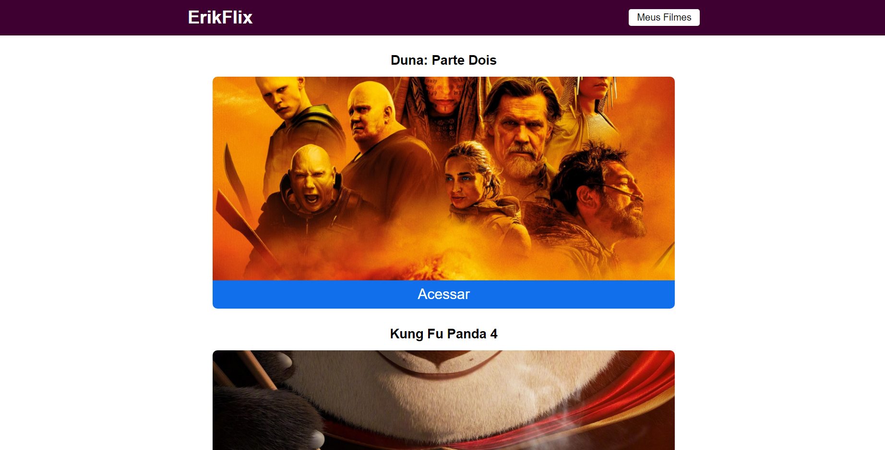

# README

Site de exibição de filmes em cartaz criado em React.js utilizando a api do The Movie DB: *https://api.themoviedb.org/3/*

É possível visualizar a sinopse dos filmes, trailer no youtube e salvá-los em uma lista.

